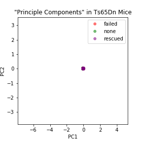

# Demo Notebooks

1. Deep Learning on Images
    * [Field Location Prediction](Field%20Location%20Prediction.ipynb)
    * 
2. Advanced Feature Selection
    * [LIME demo](LIME%20demo.ipynb)
3. Basic Feature Selection and Classifcation
    * [WDBC data](WDBC_1_data.ipynb)
    * [WDBC Visualization](WDBC_2_viz.ipynb)
    * [WDBC classification](WDBC_3_classification.ipynb)
4. Advanced PCA, PLS-DA, and Autoencoder
    * [Mice Proteins PCA PLS-DA](mice_proteins_pca_plsda.ipynb)
    * [Mice Proteins Autoencoder](mice_proteins_mxnet_autoencoder.ipynb)
    * [Mice Proteins Neural Net Classification](mice_proteins_mxnet_classify.ipynb)
    * 